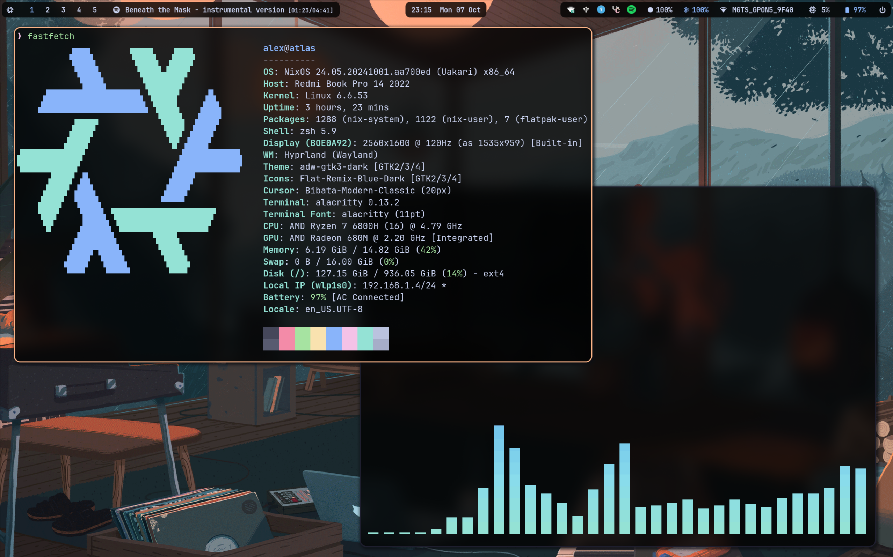
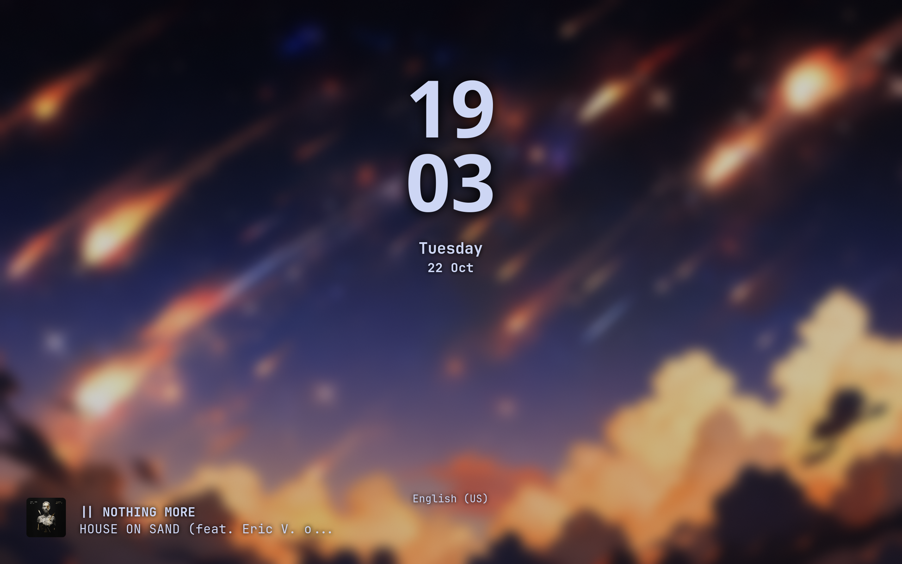

<h1 align="center">
    Chilipizdrick's NixOS dotfiles
</h1>




## Prerequisites

- Installation of NixOS

## Installation

Replace `<host>` below with preferred host configuration (one of `atlas`, `aurora`).

```sh
export NIX_CONFIG="experimental-features = nix-command flakes"
nix shell nixpkgs#git
git clone --depth=1 https://github.com/chilipizdrick/dotfiles.git
cd dotfiles
cp -f /etc/nixos/hardware-configuration.nix ./nixos/hosts/<host>/hardware-configuration.nix
sudo nixos-rebuild switch --flake .#<host>
home-manager switch --flake .
```

## Thanks to

- [zDyant](https://github.com/zDyanTB) and [Ja.KooLit](https://github.com/JaKooLit) for creating insanely cool dotfiles
- [Gabriel Fontes](https://github.com/Misterio77) for creating comprehensive and comprehensible starting templates for NixOS and home-manager configurations

